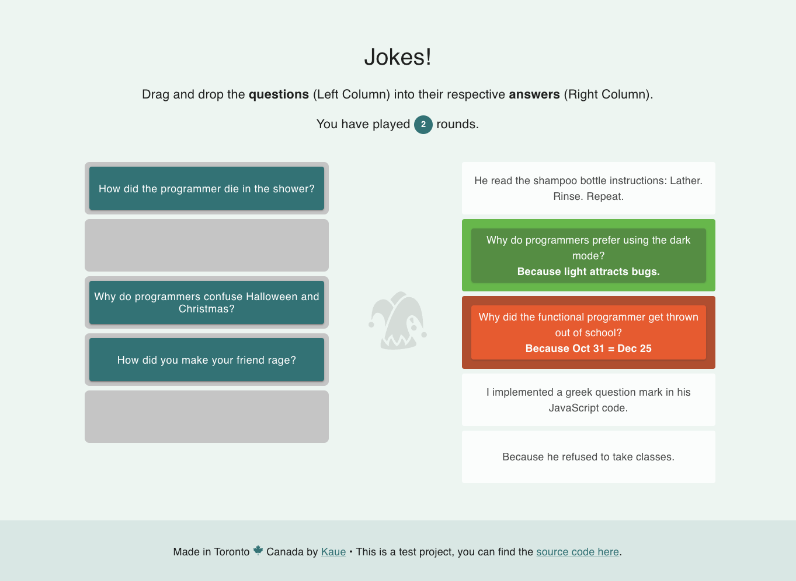

# JOKES!

This is a game built using the [Jokes API](https://v2.jokeapi.dev/), where you are presented with two-part jokes. Your goal is to match the setup with the correct delivery by dragging and dropping the elements.

## This project uses:

- **Vite**
- **React**
- **React DnD**
- **Axios**
- **Zustand**
- **Material UI**
- **Vitest / React Testing Library**

## Live Demo

Check the live demo on this [link](https://jokes-self.vercel.app/), hosted on Vercel.

## Local Dev Instructions

1. git clone https://github.com/kauecode/jokes.git
2. cd jokes
3. 'npm install'
4. 'npm run dev'
5. 'npm run test' for testing suite
6. 'npm run test:report' for coverage report
6. 'npm run test:ui' to launch test interface